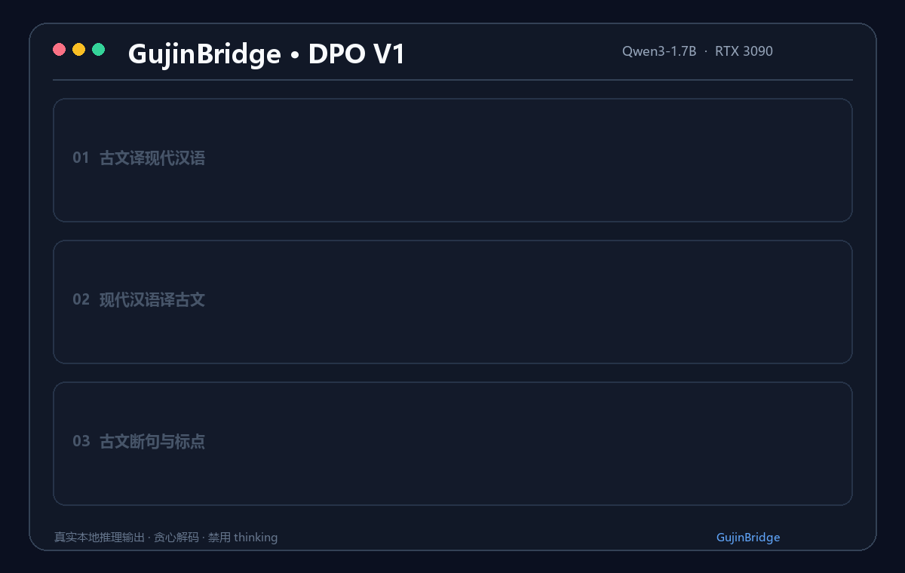

# GujinBridge（古今桥）

> 可溯源的文言文翻译、断句、释义与典籍问答模型训练项目。

GujinBridge 是一个面向中国古典文献的领域大模型项目。它基于
[MedicalGPT](https://github.com/shibing624/MedicalGPT) 的通用训练引擎改造，保留 PT、SFT、LoRA/QLoRA、
DPO、ORPO、GRPO、RLOO 和 OPD 等训练能力，并新增古籍数据准备、按出处隔离的数据切分、领域提示词、
训练脚本和评测工具。

本项目不是简单替换项目名称：新的默认数据、训练入口、模型定位和评测流程均围绕古典文献任务设计。
原项目的许可证与贡献说明保留在 [LICENSE](LICENSE)、[NOTICE](NOTICE) 和 [CITATION.cff](CITATION.cff) 中。

## 当前模型与实验结论

当前发布候选为 **Qwen3-1.7B + V5 SFT merged + DPO V1 LoRA**。在 1,440 条按典籍来源隔离的冻结测试集
上，DPO 将总体字符 F1 从 V5 SFT 的 72.69% 提升至 73.39%，并将标点原文保留率从 64.54% 提升至
71.19%。后续 V6 定向 SFT 与两轮 GRPO 均完成受控评测，但没有形成稳定综合优势，因此未替换 DPO。

已合并、可直接推理的模型权重发布在
[Hugging Face：tzh699/GujinBridge-Qwen3-1.7B-DPO](https://huggingface.co/tzh699/GujinBridge-Qwen3-1.7B-DPO)。



- [最终实验报告](docs/FINAL_EXPERIMENT_REPORT.md)
- [训练与后训练流程](docs/TRAINING_PIPELINE.md)
- [模型卡](MODEL_CARD.md)
- [简历与面试说明](docs/INTERVIEW_GUIDE.md)

## 项目能力

- 古文翻译为现代汉语（`c2m`）
- 现代汉语改写为文言文（`m2c`）
- 古文断句和添加标点（`punctuate`）
- 基于典籍原文的检索增强问答（RAG）
- CLI、Gradio、FastAPI、类 OpenAI API 和 vLLM 部署
- LoRA、QLoRA、全参数、DeepSpeed 和多卡训练
- DPO/ORPO 偏好对齐、GRPO 推理训练、OPD Teacher-Student 蒸馏

领域系统提示词位于 [`configs/gujinbridge_system_prompt.txt`](configs/gujinbridge_system_prompt.txt)。

## 推荐数据集

默认推荐使用
[gujilab/chinese-classical-corpus](https://github.com/gujilab/chinese-classical-corpus)：

- 约 192 万条古译今、今译古双向翻译指令；
- 约 4.6 万条断句加标点指令；
- 覆盖经、史、子、集等 97 部典籍；
- 指令数据采用 CC0，底层 NiuTrans 数据采用 MIT；
- 原始格式已经包含 `instruction`、`input`、`output`、`task`、`source` 和 `category`。

正式使用前请自行复核上游数据版本、许可证和数据质量。本仓库只包含少量公有领域演示样本，不直接提交约
700 MB 的完整数据集。

## 项目结构

```text
GujinBridge/
├── configs/                       # 领域系统提示词
├── data/gujinbridge/              # 演示数据和数据准备说明
├── training/                      # 通用 PT/SFT/偏好对齐/蒸馏训练引擎
├── scripts/
│   ├── run_sft_gujinbridge_v5.ps1 # V5 LoRA SFT
│   ├── run_dpo_gujinbridge_v1.ps1 # DPO 偏好对齐
│   ├── run_grpo_gujinbridge_v2.ps1 # GRPO 密集奖励实验
│   └── try_gujinbridge.ps1        # 当前最佳模型演示
├── tools/
│   ├── download_gujinbridge_dataset.py
│   ├── prepare_gujinbridge_dataset.py
│   ├── audit_gujinbridge_dataset.py
│   ├── export_gujinbridge_gold_candidates.py
│   ├── export_gujinbridge_eval.py
│   └── evaluate_gujinbridge_predictions.py
├── demo/                          # CLI、Web、API、RAG
├── MODEL_CARD.md                  # 当前发布候选的模型卡
├── NOTICE                         # 上游项目与数据集署名
└── README.md
```

旧版 MedicalGPT 的通用训练文件仍在仓库中，方便继续使用 PT、DPO、ORPO、GRPO、RLOO 和 OPD；新的
GujinBridge 脚本不会读取 `data/sft/medical_sft_1K_format.jsonl` 等医疗演示数据。

## 环境安装

推荐 Linux 或 WSL2 + NVIDIA CUDA。Python 版本和 PyTorch 版本应根据显卡/CUDA 环境选择。

```bash
python -m venv .venv
source .venv/bin/activate

# 请先从 PyTorch 官网选择与你 CUDA 对应的安装命令
pip install torch
pip install -r requirements.txt
```

以下能力需要按需安装额外依赖：

```bash
# 量化训练
pip install bitsandbytes

# Web/API 演示
pip install gradio fastapi uvicorn

# RAG
pip install similarities jieba pypdf python-docx markdown beautifulsoup4

# vLLM 部署（Linux）
pip install vllm
```

所有命令均从项目根目录执行。

## 数据准备

### 1. 下载上游数据

下载脚本会调用 Hugging Face Hub，只下载 JSONL 和必要说明文件：

```bash
python tools/download_gujinbridge_dataset.py \
  --output-dir data/gujinbridge/raw
```

也可以手工下载 `translate.jsonl` 和 `punctuate.jsonl`，放入 `data/gujinbridge/raw/`。下载数据不会提交到 Git。

### 2. 转换成 ShareGPT 并切分

```bash
python tools/prepare_gujinbridge_dataset.py \
  --input data/gujinbridge/raw \
  --output-dir data/gujinbridge/processed
```

默认从全量数据中确定性抽样：

- `c2m=60000`
- `m2c=40000`
- `punctuate=20000`

输出目录：

```text
data/gujinbridge/processed/
├── train/gujinbridge_train.jsonl
├── validation/gujinbridge_validation.jsonl
├── test/gujinbridge_test.jsonl
└── manifest.json
```

切分以 `source` 为组，同一出处不会同时进入训练和测试数据。默认过滤 `_has_box=true`、过短、过长及字段
缺失的记录，并为每种任务在验证集、测试集各保留至少 3 个独立来源（来源不足时自动降低）。断句数据还会默认检查正文一致性、有效标点密度、句末标点、引号嵌套和切片开头的异常结束标点；仅在复现实验时，可用 `--allow-low-quality-punctuation` 关闭这些规则。自定义采样量示例：

```bash
python tools/prepare_gujinbridge_dataset.py \
  --input data/gujinbridge/raw \
  --output-dir data/gujinbridge/processed \
  --task-limits c2m=100000,m2c=60000,punctuate=30000 \
  --seed 42
```

转换后的训练样本类似：

```json
{
  "id": "lunyu-001",
  "task": "c2m",
  "source": "论语·学而",
  "category": "经",
  "conversations": [
    {"from": "system", "value": "你是古今桥（GujinBridge）……"},
    {"from": "human", "value": "将下列古文翻译成现代汉语：\n\n学而时习之，不亦说乎？"},
    {"from": "gpt", "value": "学习之后按时温习，不也是一件愉快的事吗？"}
  ]
}
```

`data/gujinbridge/demo/` 中包含可用于验证转换格式和训练入口的小样本，但不足以训练有意义的模型。

### 数据质量审计与黄金集候选

转换后先运行启发式审计。审计结果只是人工复核候选，不会自动删除数据：

```bash
python tools/audit_gujinbridge_dataset.py \
  --input data/gujinbridge/processed_v4 \
  --report data/gujinbridge/audit/v4_report.json \
  --flagged data/gujinbridge/audit/v4_flagged.jsonl \
  --overwrite
```

从未被标记的测试样本中为每类任务导出 100 条、尽量覆盖不同来源的人工审核候选：

```bash
python tools/export_gujinbridge_gold_candidates.py \
  --dataset data/gujinbridge/processed_v4/test/gujinbridge_test.jsonl \
  --audit-flags data/gujinbridge/audit/v4_flagged.jsonl \
  --output data/gujinbridge/gold/v4_candidates.jsonl \
  --per-task 100 \
  --overwrite
```

必须逐条确认 `prompt`、`reference` 和 `source`，将 `review_status` 改为 `approved` 并填写必要的
`approved_reference`，才能将候选集作为正式黄金测试集。当前推荐使用 v4，详见
[`docs/data_v4_report_2026-10-05.md`](docs/data_v4_report_2026-10-05.md)。v2 历史报告和审核过程分别见
[`docs/data_v2_report_2026-10-03.md`](docs/data_v2_report_2026-10-03.md) 与
[`docs/gpt56_review_report_2026-10-05.md`](docs/gpt56_review_report_2026-10-05.md)。

## SFT 训练

### Linux / WSL2

```bash
bash scripts/run_sft_gujinbridge.sh
```

可通过环境变量覆盖配置：

```bash
BASE_MODEL=Qwen/Qwen3.5-0.8B \
TRAIN_DIR=data/gujinbridge/processed/train \
VALIDATION_DIR=data/gujinbridge/processed/validation \
OUTPUT_DIR=outputs-gujinbridge-sft \
bash scripts/run_sft_gujinbridge.sh
```

### Windows PowerShell

```powershell
./scripts/run_sft_gujinbridge.ps1 `
  -BaseModel "Qwen/Qwen3.5-0.8B" `
  -TrainDir "data/gujinbridge/processed/train" `
  -ValidationDir "data/gujinbridge/processed/validation"
```

默认配置是单卡 LoRA、BF16、1024 token 上下文。显卡不支持 BF16 时，可在脚本中改为 FP16。

### 使用演示数据做冒烟测试

```bash
TRAIN_DIR=data/gujinbridge/demo/train \
VALIDATION_DIR=data/gujinbridge/demo/validation \
MAX_STEPS=2 \
bash scripts/run_sft_gujinbridge.sh
```

冒烟测试仅用于验证环境和数据格式。

## 合并 LoRA

```bash
python tools/merge_peft_adapter.py \
  --base_model Qwen/Qwen3.5-0.8B \
  --lora_model outputs-gujinbridge-sft \
  --output_dir outputs-gujinbridge-merged
```

如果下一阶段要做 DPO、ORPO、GRPO 或 OPD，应让下一阶段的 `model_name_or_path` 指向合并后的模型。

## 推理

### 一键体验当前 GujinBridge

Windows PowerShell 中运行：

```powershell
.\scripts\try_gujinbridge.ps1
```

脚本会自动加载当前选定的 `outputs-gujinbridge-v5-merged` 与
`outputs-gujinbridge-dpo-v1-qwen3-1.7b` LoRA，依次演示古文译现代汉语、现代汉语译古文、
古文断句标点，然后进入交互模式。启动器默认使用本机模型缓存，不会联网下载。交互时可使用：

```text
/c2m 学而时习之，不亦说乎？
/m2c 学习必须持之以恒，不能半途而废。
/punct 学而不思则罔思而不学则殆
/quit
```

只看三个内置示例并在完成后退出：

```powershell
.\scripts\try_gujinbridge.ps1 -NoInteractive
```

也可以直接使用 Python：

```bash
python demo/try_gujinbridge.py
```

加载 Base + LoRA：

```bash
python demo/inference.py \
  --base_model outputs-gujinbridge-v5-merged \
  --lora_model outputs-gujinbridge-dpo-v1-qwen3-1.7b \
  --system_prompt_file configs/gujinbridge_system_prompt.txt \
  --temperature 0 \
  --interactive
```

加载已合并模型：

```bash
python demo/inference.py \
  --base_model outputs-gujinbridge-merged \
  --system_prompt_file configs/gujinbridge_system_prompt.txt \
  --temperature 0.2 \
  --interactive
```

## 基础评测

先导出测试集问题和参考答案：

```bash
python tools/export_gujinbridge_eval.py \
  --dataset data/gujinbridge/processed_v5_final/test/gujinbridge_test.jsonl \
  --prompts-file data/gujinbridge/eval/prompts.txt \
  --references-file data/gujinbridge/eval/references.jsonl
```

批量生成：

```bash
python demo/inference.py \
  --base_model outputs-gujinbridge-v5-merged \
  --lora_model outputs-gujinbridge-dpo-v1-qwen3-1.7b \
  --system_prompt_file configs/gujinbridge_system_prompt.txt \
  --data_file data/gujinbridge/eval/prompts.txt \
  --output_file data/gujinbridge/eval/predictions.jsonl \
  --temperature 0
```

计算严格匹配和字符级 F1：

```bash
python tools/evaluate_gujinbridge_predictions.py \
  --references data/gujinbridge/eval/references.jsonl \
  --predictions data/gujinbridge/eval/predictions.jsonl
```

字符级指标只适合做回归测试，不足以完整评价翻译质量。正式发布建议加入：

当前 Qwen3-1.7B Base/LoRA 实测对比见
[`docs/evaluation_report_2026-10-03.md`](docs/evaluation_report_2026-10-03.md)。

- 上游 `chinese-classical-bench`；
- 人工忠实度、流畅度和出处核验；
- 典籍级隔离评测；
- 幻觉、伪造出处和不确定性测试。

## 已完成的后训练实验

V5 SFT、DPO V1、V6 定向 SFT、GRPO V1 和 GRPO V2 均已训练并在冻结测试集上完成 A/B 评测。

| 模型 | Overall F1 | c2m F1 | m2c F1 | 标点原文保留率 | 决策 |
|---|---:|---:|---:|---:|---|
| V5 SFT | 72.69% | 62.82% | 68.17% | 64.54% | SFT 基线 |
| **DPO V1** | **73.39%** | 63.85% | **68.67%** | **71.19%** | **当前发布模型** |
| V6 targeted SFT | 73.39% | **63.95%** | 68.56% | 70.36% | 未晋级 |

GRPO 使用独立的 361 条标点受控评测。V2 checkpoint-50 是最佳 GRPO 实验模型，Boundary-F1 为
64.81%，仍低于同设置 DPO 的 65.13%，因此保留为消融实验。完整指标、奖励分析和模型选择依据见
[`docs/FINAL_EXPERIMENT_REPORT.md`](docs/FINAL_EXPERIMENT_REPORT.md)。

## 许可证与署名

- 训练框架派生自 MedicalGPT，代码按 Apache License 2.0 使用；
- GujinBridge 新增代码同样按 Apache License 2.0 发布；
- 上游古籍指令数据的许可证以数据集仓库为准；
- 发布模型时应同时列出 Base Model、训练数据、MedicalGPT 和 GujinBridge 的来源；
- “古今桥”模型不能替代专业古籍整理、校勘或学术判断。

详细上游说明见 [NOTICE](NOTICE)。
