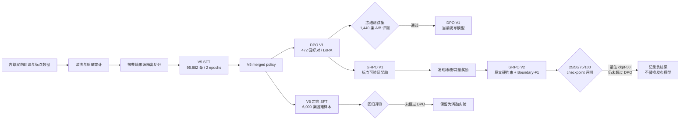

# GujinBridge 训练与后训练流程

## 数据治理

- 从约 192 万条双向翻译和约 4.6 万条标点数据中构造领域指令集。
- V5 最终保留 98,479 条，其中训练 95,882、验证 1,157、测试 1,440。
- 以典籍 `source` 为组切分，训练、验证、测试来源互斥。
- 过滤正文不一致、异常标点、长度异常等 3,747 条未审核风险记录。
- 保留 243 条高置信度人工/模型辅助审核样本作为黄金评测记录。

## 训练决策

| 阶段 | 目的 | 训练对象 | 结论 |
|---|---|---|---|
| V5 SFT | 建立三任务领域能力 | Qwen3-1.7B + LoRA | 稳定收敛，形成后训练初始策略 |
| DPO V1 | 偏好对齐与错误修复 | V5 merged + LoRA | 1,440 条冻结集上总体 F1 与标点保真率均提升 |
| V6 targeted SFT | 修复困难翻译样本 | V5 merged + LoRA | 与 DPO 基本持平，未晋级 |
| GRPO V1 | 验证可编程标点奖励 | V5 + DPO + GRPO LoRA | 发现 Exact/Format 奖励缺少区分度 |
| GRPO V2 | 使用密集边界奖励 | V5 + DPO + GRPO LoRA | 比 V1 最终模型改善，但未超过 DPO |

## 模型晋级原则

1. 所有候选模型必须使用同一冻结测试集、系统提示词和解码参数。
2. 训练 loss 或 reward 只用于诊断，不作为模型晋级依据。
3. 翻译关注分任务 F1、错误类型与人工审核；标点优先看 Boundary-F1 和原文字保留率。
4. 任一专项提升若以其他任务明显退化为代价，则不替换当前发布模型。
5. 无显著收益的实验保留记录，用于解释假设、验证过程和下一轮设计。
